# Mermaid Diagrams for Presentation
**For: Vendor Risk Digital Twin - Cloud Computing Presentation**

This file contains Mermaid diagram code that can be used in presentations, documentation, or converted to images.

---

## 1. 4-Layer Architecture Diagram

---

## 2. Graph Data Model

---

## 3. Event-Driven Discovery Flow

---

## 4. Simulation Flow

```mermaid
flowchart TD
    Start([User Request:<br/>Simulate Vendor Failure]) --> API[Simulation Service<br/>Cloud Run]
    API --> Query[Neo4j Query:<br/>Find Affected Services]
    Query --> Traverse[Graph Traversal:<br/>Vendor → Services → Processes]
    Traverse --> Calc[Impact Calculation]
    
    Calc --> Op[Operational Impact<br/>40% weight]
    Calc --> Fin[Financial Impact<br/>35% weight]
    Calc --> Comp[Compliance Impact<br/>25% weight]
    
    Op --> Combine[Combine Scores]
    Fin --> Combine
    Comp --> Combine
    
    Combine --> Results[Return Results<br/><2 seconds]
    Results --> PubSub[Publish to Pub/Sub]
    PubSub --> BQ[BigQuery<br/>Analytics]
    
    style Start fill:#e1f5ff
    style Results fill:#c8e6c9
    style Calc fill:#fff9c4
```

---

## 5. CI/CD Pipeline Flow

```mermaid
flowchart LR
    Code[Code Changes] --> Trigger{Trigger}
    Trigger -->|Manual| Manual[gcloud builds submit]
    Trigger -->|GitHub| GitHub[GitHub Push]
    
    Manual --> Build[Cloud Build]
    GitHub --> Build
    
    Build --> Test[Run Tests<br/>pytest]
    Test --> Docker[Build Docker Image]
    Docker --> Deploy[Deploy Services]
    
    Deploy --> CR[Cloud Run<br/>simulation-service]
    Deploy --> CF1[Cloud Function<br/>vendor-discovery]
    Deploy --> CF2[Cloud Function<br/>graph-loader]
    Deploy --> CF3[Cloud Function<br/>bigquery-loader]
    
    CR --> Done[✅ All Services<br/>Deployed]
    CF1 --> Done
    CF2 --> Done
    CF3 --> Done
    
    style Build fill:#fff4e1
    style Done fill:#c8e6c9
```

---

## 6. Complete System Flow (End-to-End)

---

## 7. GCP Services Integration

---

## Usage Instructions

### For Presentations:
1. Copy the Mermaid code
2. Use in tools that support Mermaid:
   - **Markdown viewers** (GitHub, GitLab, etc.)
   - **Mermaid Live Editor**: https://mermaid.live
   - **Presentation tools** (some support Mermaid)
   - **Documentation tools** (Confluence, Notion, etc.)

### To Convert to Images:
1. Go to https://mermaid.live
2. Paste the Mermaid code
3. Export as PNG/SVG
4. Use in PowerPoint, Google Slides, etc.

### For Documentation:
- These diagrams can be embedded directly in Markdown files
- GitHub/GitLab will render them automatically

---

**Last Updated:** 2025-12-01  
**Purpose:** Mermaid diagram code for Cloud Computing presentation
